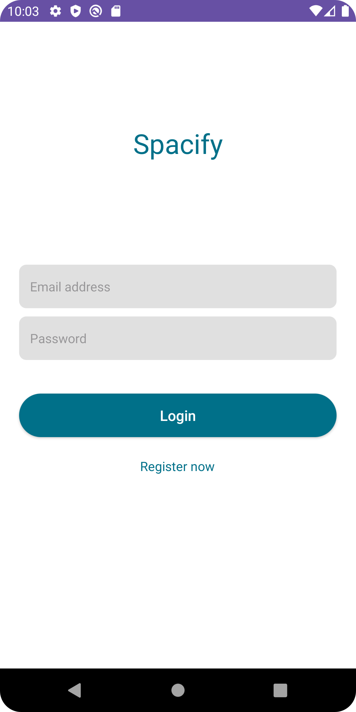
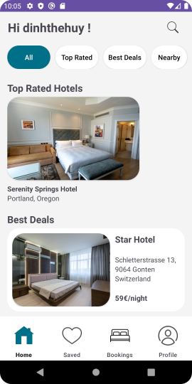

# Spacify

## Overview

Spacify is a prototype designed to implement new UI designs that help users navigate easier in a hotel-booking app. The prototype has basic functions such as creating account, manage user's information, book a hotel. The data used in this prototype are only fictional and all hotels don't reference any real businesses. 

### Screenshots
 

## Getting Started
This guide helps you set up a copy of the project on your local machine and use it for development and testing purposes.

### Prerequisites
* Android Studio Hedgehog
* Android SDK 34
* Minimum Android device SDK 26

### Executing program
* Import folder HCIPrototypWS23
* Wait for Gradle to sync
* Run the app 

## Contributors
* Dinh The Huy
* Sohayl Kaur
* Verrell Vimalaputra
* Le Thanh Trung
